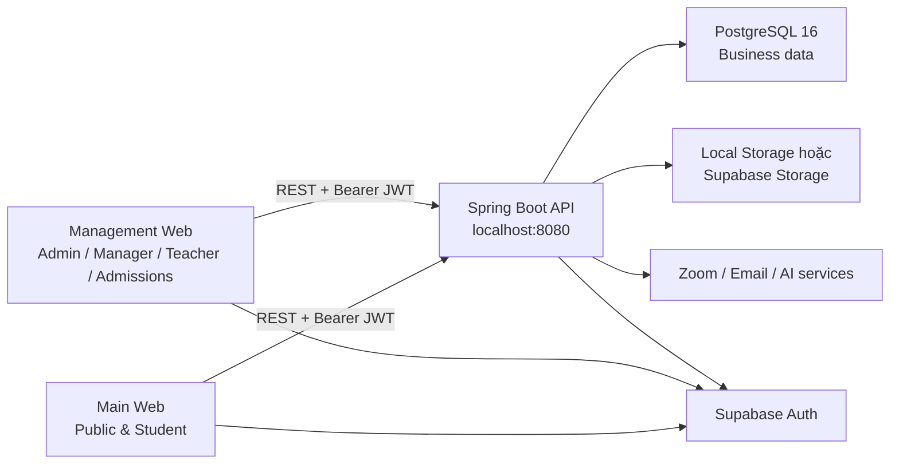

# The IELTS Spells Backend

Backend của **The IELTS Spells**, nền tảng quản lý đào tạo và học tập IELTS tích hợp các luồng vận hành trung tâm, theo dõi tiến độ, kho học liệu, ngân hàng đề và các chức năng đánh giá bằng AI.

Ứng dụng được xây dựng dưới dạng **Spring Boot Modular Monolith**: triển khai như một service duy nhất trong giai đoạn MVP nhưng chia tách rõ theo domain để dễ kiểm thử, bảo trì và tách thành service độc lập khi hệ thống phát triển.

## Mục lục

- [Chức năng chính](#chức-năng-chính)
- [Vị trí trong hệ thống](#vị-trí-trong-hệ-thống)
- [Kiến trúc tổng thể](#kiến-trúc-tổng-thể)
- [Công nghệ sử dụng](#công-nghệ-sử-dụng)
- [Cấu trúc dự án](#cấu-trúc-dự-án)
- [Yêu cầu môi trường](#yêu-cầu-môi-trường)
- [Cài đặt và chạy local](#cài-đặt-và-chạy-local)
- [Cấu hình môi trường](#cấu-hình-môi-trường)
- [Database và migration](#database-và-migration)
- [Kiểm thử và build](#kiểm-thử-và-build)
- [API và tài liệu kỹ thuật](#api-và-tài-liệu-kỹ-thuật)
- [Xử lý sự cố thường gặp](#xử-lý-sự-cố-thường-gặp)

## Chức năng chính

- Xác thực Supabase JWT và phân quyền cho Admin, Manager, Teacher, Admissions.
- Quản lý nhân sự, lời mời kích hoạt tài khoản và hồ sơ người dùng.
- Quản lý học viên, khách tiềm năng, ghi danh và vòng đời học vụ.
- Quản lý khóa học, session, thời khóa biểu, giáo viên phụ trách và Zoom.
- Điểm danh theo từng session, hỗ trợ dữ liệu thủ công và nguồn tích hợp.
- Theo dõi tiến độ học tập theo cặp kỹ năng Listening–Reading hoặc Speaking–Writing.
- Quản lý bài tập, bài nộp, hạn nộp và hoạt động trong session.
- Kho học liệu, media, bài tập mẫu, upload/download file và gắn tài liệu vào khóa học.
- Ngân hàng đề và Test Builder cho đề IELTS, bắt đầu với Reading.
- CMS, tuyển sinh, thông báo, báo cáo và đánh giá Writing bằng AI theo lộ trình phát triển.

> Trong mô hình nghiệp vụ hiện tại, **khóa học và lớp học là một aggregate `Course`**. Mỗi khóa chỉ đào tạo một cặp kỹ năng: `LISTENING_READING` hoặc `SPEAKING_WRITING`.

## Vị trí trong hệ thống



- Frontend xác thực người dùng qua Supabase và gửi access token trong header `Authorization: Bearer <token>`.
- Backend xác minh JWT, áp dụng RBAC và xử lý toàn bộ nghiệp vụ.
- PostgreSQL là nguồn dữ liệu chuẩn cho dữ liệu vận hành.
- Supabase service-role key chỉ được sử dụng ở backend.

## Kiến trúc tổng thể

Mỗi domain là một module trực tiếp dưới package `com.theieltsspells` và thường gồm bốn lớp:

| Lớp | Trách nhiệm |
| --- | --- |
| `domain` | Entity, value object, enum, quy tắc và trạng thái nghiệp vụ |
| `application` | Use case, orchestration, transaction và DTO mapping |
| `infrastructure` | JPA repository, storage, email, Supabase, Zoom và adapter ngoài |
| `presentation` | REST Controller, validation đầu vào và HTTP response |

Luồng xử lý tiêu chuẩn:

```text
HTTP Request
  -> Presentation / Controller
  -> Application Service / Use Case
  -> Domain Rules
  -> Repository hoặc External Adapter
  -> Response DTO
```

Các module không truy cập trực tiếp repository hoặc JPA entity của nhau. Giao tiếp liên module đi qua application API công khai hoặc domain event. `ModularityTests` kiểm tra ranh giới này.

## Công nghệ sử dụng

| Thành phần | Công nghệ |
| --- | --- |
| Ngôn ngữ | Java 21 |
| Framework | Spring Boot 3.5 |
| Kiến trúc module | Spring Modulith 1.4 |
| REST API | Spring Web MVC |
| Validation | Jakarta Validation |
| Security | Spring Security, OAuth2 Resource Server, Supabase JWT |
| Persistence | Spring Data JPA, Hibernate |
| Database | PostgreSQL 16 |
| Migration | Flyway |
| API documentation | Springdoc OpenAPI / Swagger UI |
| Monitoring | Spring Boot Actuator |
| Email | Spring Mail |
| Test | JUnit 5, Spring Boot Test, Spring Security Test, Testcontainers |
| Build | Maven 3.9+ |
| Container | Docker, Docker Compose |

## Cấu trúc dự án

```text
the-ielts-spells-backend/
├─ src/
│  ├─ main/
│  │  ├─ java/com/theieltsspells/
│  │  │  ├─ academic/          # Khóa học, session, ghi danh, vòng đời học vụ
│  │  │  ├─ admissions/        # Lead và tuyển sinh
│  │  │  ├─ assignment/        # Bài tập và bài nộp
│  │  │  ├─ attendance/        # Điểm danh theo session
│  │  │  ├─ identity/          # Người dùng, học viên, nhân sự, lời mời
│  │  │  ├─ learninglibrary/   # Học liệu, file, media, bài tập mẫu
│  │  │  ├─ progress/          # Tiến độ và kết quả hoạt động
│  │  │  ├─ testing/           # Ngân hàng đề và Test Builder
│  │  │  ├─ cms/               # Nội dung công khai
│  │  │  ├─ curriculum/        # Lộ trình và nội dung đào tạo
│  │  │  ├─ notification/      # Thông báo
│  │  │  ├─ reporting/         # Báo cáo
│  │  │  ├─ writingevaluation/ # Đánh giá Writing
│  │  │  └─ shared/            # Security, config, web và thành phần dùng chung
│  │  └─ resources/
│  │     ├─ application.yml
│  │     └─ db/migration/      # Flyway migrations
│  └─ test/java/               # Unit và integration tests
├─ data/uploads/                # File local khi FILE_STORAGE_PROVIDER=LOCAL
├─ docs/                        # Tài liệu kỹ thuật và script hỗ trợ
├─ compose.yaml                 # PostgreSQL local
├─ Dockerfile
├─ .env.example
├─ AGENTS.md                    # Quy ước làm việc cho AI agent
└─ pom.xml
```

## Yêu cầu môi trường

- **Java Development Kit 21**.
- **Maven 3.9+** hoặc Maven tích hợp trong IDE.
- **Docker Desktop** và Docker Compose để chạy PostgreSQL local.
- Git.
- Một project Supabase để đăng nhập và kiểm thử endpoint được bảo vệ.

Kiểm tra:

```bash
java -version
mvn -version
docker --version
docker compose version
```

## Cài đặt và chạy local

### 1. Clone và vào thư mục backend

```bash
git clone <backend-repository-url>
cd the-ielts-spells-backend
```

### 2. Tạo file môi trường

**PowerShell**

```powershell
Copy-Item .env.example .env
```

**Bash**

```bash
cp .env.example .env
```

Cập nhật ít nhất cấu hình Supabase JWT và CORS trong `.env`. Không commit file này.

### 3. Khởi động PostgreSQL

```bash
docker compose up -d postgres
docker compose ps
```

Container tạo database local với thông tin mặc định:

| Thuộc tính | Giá trị |
| --- | --- |
| Host | `localhost` |
| Port | `5432` |
| Database | `ielts_center` |
| Username | `ielts` |
| Password | `ielts` |

### 4. Chạy backend

```bash
mvn spring-boot:run
```

Khi ứng dụng khởi động, Flyway tự chạy các migration chưa được áp dụng.

### 5. Kiểm tra

- API base: [http://localhost:8080/api/v1](http://localhost:8080/api/v1)
- Swagger UI: [http://localhost:8080/swagger-ui](http://localhost:8080/swagger-ui)
- Health check: [http://localhost:8080/actuator/health](http://localhost:8080/actuator/health)

Để gọi endpoint bảo vệ trong Swagger, chọn **Authorize** và nhập access token Supabase theo dạng:

```text
Bearer eyJ...
```

## Cấu hình môi trường

Spring Boot tự đọc file `.env` ở thư mục gốc qua `application.yml`.

### Database và HTTP

| Biến | Ý nghĩa | Giá trị local gợi ý |
| --- | --- | --- |
| `DATABASE_URL` | JDBC URL PostgreSQL | `jdbc:postgresql://localhost:5432/ielts_center` |
| `DATABASE_USERNAME` | Tài khoản database | `ielts` |
| `DATABASE_PASSWORD` | Mật khẩu database | `ielts` |
| `PORT` | Cổng backend | `8080` |
| `CORS_ALLOWED_ORIGINS` | Origin frontend được phép gọi API | `http://localhost:3000,http://localhost:5174` |

### Supabase Auth

| Biến | Ý nghĩa |
| --- | --- |
| `SUPABASE_JWT_ISSUER` | Issuer của Supabase Auth |
| `SUPABASE_JWK_SET_URI` | Endpoint JWKS dùng xác minh chữ ký JWT |
| `SUPABASE_JWT_AUDIENCE` | Audience, mặc định `authenticated` |
| `SUPABASE_URL` | URL project Supabase |
| `SUPABASE_SERVICE_ROLE_KEY` | Khóa server-only cho thao tác quản trị |

> Không đưa `SUPABASE_SERVICE_ROLE_KEY` vào frontend, Git, log hoặc ảnh chụp màn hình.

Để đăng ký học viên trên Main Web hoạt động đầy đủ, migration `V002__supabase_jwt_role_hook.sql`
phải được áp dụng và `public.custom_access_token_hook` phải được bật tại
Supabase Dashboard > Authentication > Hooks. Endpoint xác thực
`POST /api/v1/auth/student/onboarding` tạo idempotent `profiles`,
`student_profiles` và role `STUDENT` sau khi Supabase đã xác thực người dùng.

### File storage

| Biến | Ý nghĩa |
| --- | --- |
| `FILE_STORAGE_PROVIDER` | `LOCAL` hoặc provider Supabase được hỗ trợ |
| `FILE_STORAGE_LOCAL_DIRECTORY` | Thư mục lưu file khi chạy local |
| `FILE_STORAGE_MAX_UPLOAD_BYTES` | Giới hạn upload do ứng dụng kiểm tra |
| `FILE_STORAGE_MAX_FILE_SIZE` | Giới hạn multipart cho một file |
| `FILE_STORAGE_MAX_REQUEST_SIZE` | Giới hạn toàn request multipart |
| `SUPABASE_STORAGE_BUCKET` | Bucket khi dùng Supabase Storage |

### Lời mời nhân sự và email

| Biến | Ý nghĩa |
| --- | --- |
| `MANAGEMENT_APP_URL` | URL web quản trị dùng trong invitation link |
| `ADMIN_APPROVAL_EMAIL` | Email quản trị gốc |
| `MAIL_HOST`, `MAIL_PORT` | SMTP server |
| `MAIL_USERNAME`, `MAIL_PASSWORD` | Tài khoản SMTP hoặc app password |
| `MAIL_FROM` | Địa chỉ người gửi |

Nếu chưa kiểm thử email, có thể để trống cấu hình mail; các luồng gửi mail tương ứng sẽ không hoạt động đầy đủ.

### AI đa provider

Backend dùng `AiProviderRouter` để điều phối Gemini và NVIDIA theo từng loại tác vụ. Mỗi tác vụ có thứ tự provider, danh sách model và timeout riêng:

| Nhóm biến | Ý nghĩa |
| --- | --- |
| `AI_IMPORT_PROVIDERS`, `AI_CHAT_PROVIDERS`, `AI_QUIZ_PROVIDERS` | Thứ tự provider, ví dụ `GEMINI,NVIDIA` |
| `GEMINI_*_MODELS`, `NVIDIA_*_MODELS` | Danh sách model thử lần lượt cho import, chat và quiz |
| `AI_*_TIMEOUT_SECONDS` | Thời gian tối đa chờ một lần gọi theo loại tác vụ |
| `AI_MAX_RETRIES_PER_MODEL` | Số lần retry thêm cho lỗi timeout, mạng, 429 và 5xx |
| `AI_INITIAL_BACKOFF_MILLIS`, `AI_MAX_BACKOFF_MILLIS` | Khoảng backoff có jitter giữa các lần retry |
| `AI_CIRCUIT_FAILURE_THRESHOLD`, `AI_CIRCUIT_COOLDOWN_SECONDS` | Ngưỡng mở circuit và thời gian tạm bỏ qua route lỗi |

Router retry cùng model đối với lỗi tạm thời, sau đó chuyển model và provider. Model không tồn tại được bỏ qua; provider sai API key hoặc thiếu quyền bị tạm ngắt để request tiếp theo không tiếp tục chờ. Lỗi request 400/422 không được fallback vì thay provider không sửa được payload sai. Nếu toàn bộ route import thất bại, bộ phân tách offline vẫn được dùng và kết quả được đánh dấu bằng cảnh báo thay vì giả vờ AI đã thành công.

Không đặt API key trong frontend hoặc log. NVIDIA hosted endpoint thuộc chương trình thử nghiệm/phát triển; cần kiểm tra giấy phép và hình thức triển khai trước khi dùng production.

## Database và migration

- PostgreSQL local dùng cho phát triển, thử migration và dữ liệu test.
- Hibernate được cấu hình `ddl-auto: none`; schema chỉ được quản lý bằng Flyway.
- Migration nằm tại `src/main/resources/db/migration`.
- Mỗi thay đổi schema phải tạo file mới theo mẫu `V###__short_description.sql`.
- Không chỉnh sửa migration đã chạy trên bất kỳ môi trường dùng chung nào.
- Không dùng `Flyway clean`, drop schema hoặc reset dữ liệu nếu chưa được cho phép rõ ràng.

Xem log database:

```bash
docker compose logs postgres
```

Dừng PostgreSQL nhưng giữ dữ liệu:

```bash
docker compose stop postgres
```

Xóa volume sẽ làm mất toàn bộ dữ liệu local, vì vậy không thực hiện trừ khi chủ động muốn reset môi trường.

## Kiểm thử và build

```bash
# Chạy test
mvn test

# Kiểm tra đầy đủ tương đương CI và ranh giới module
mvn verify

# Build JAR
mvn clean package

# Chạy JAR đã build
java -jar target/the-ielts-spells-backend-*.jar

# Build Docker image
docker build -t the-ielts-spells-backend .
```

## API và tài liệu kỹ thuật

- Mọi API chính sử dụng prefix `/api/v1`.
- Endpoint quản trị thường nằm dưới `/api/v1/admin/...`.
- Response phân trang sử dụng cấu trúc `PageResponse<T>`.
- UUID được dùng làm identifier; ngày giờ truyền qua API ở định dạng ISO-8601.
- Controller trả request/response DTO, không trả trực tiếp JPA entity.
- Swagger phản ánh contract đang triển khai và hỗ trợ Bearer JWT.

Khi thay đổi API được frontend sử dụng, cập nhật đồng thời DTO/enum bên frontend và chạy kiểm tra cho cả hai repository. Xem thêm [AGENTS.md](./AGENTS.md).

## Xử lý sự cố thường gặp

### Port 5432 đã được sử dụng

Kiểm tra PostgreSQL hoặc container khác đang chiếm cổng:

```bash
docker compose ps
docker ps
```

### Backend trả 401

- Kiểm tra access token còn hạn.
- Kiểm tra issuer, JWKS URI và audience đúng project Supabase.
- Đăng xuất và đăng nhập lại để lấy JWT mới sau khi đổi role hoặc JWT signing key.

### Backend trả 403

JWT hợp lệ nhưng tài khoản không có authority cần thiết. Kiểm tra role trong hệ thống và `@PreAuthorize` của endpoint.

### Frontend bị lỗi CORS

Đảm bảo `CORS_ALLOWED_ORIGINS` chứa đúng origin đang chạy, đặc biệt management web mặc định là `http://localhost:5174`.

### Flyway không khởi động

- Kiểm tra PostgreSQL đã healthy.
- Kiểm tra thứ tự/version migration không bị trùng.
- Không sửa checksum bằng cách chỉnh migration cũ; tạo migration mới để sửa dữ liệu/schema.

### Upload thành công nhưng không thấy file

- Với provider `LOCAL`, kiểm tra `FILE_STORAGE_LOCAL_DIRECTORY` và quyền ghi của process.
- Kiểm tra metadata đã được lưu vào PostgreSQL, không chỉ có file vật lý.
- Với Supabase Storage, kiểm tra bucket, service-role key và policy.

## Quy ước đóng góp

- Đọc [AGENTS.md](./AGENTS.md) trước khi thay đổi code hoặc giao việc cho AI agent.
- Kiểm tra `git status --short` và không ghi đè thay đổi đang làm dở.
- Thay đổi contract theo workflow backend-first, sau đó đồng bộ frontend.
- Chạy `mvn verify` trước khi bàn giao thay đổi backend có code.
- Không commit `.env`, file upload local, log, token hoặc credential.
