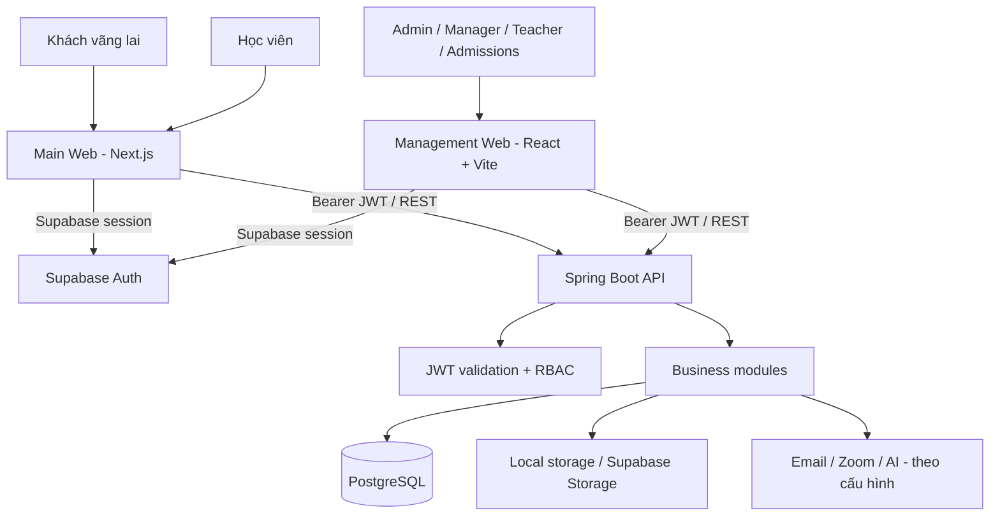
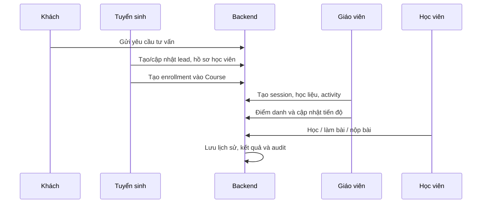
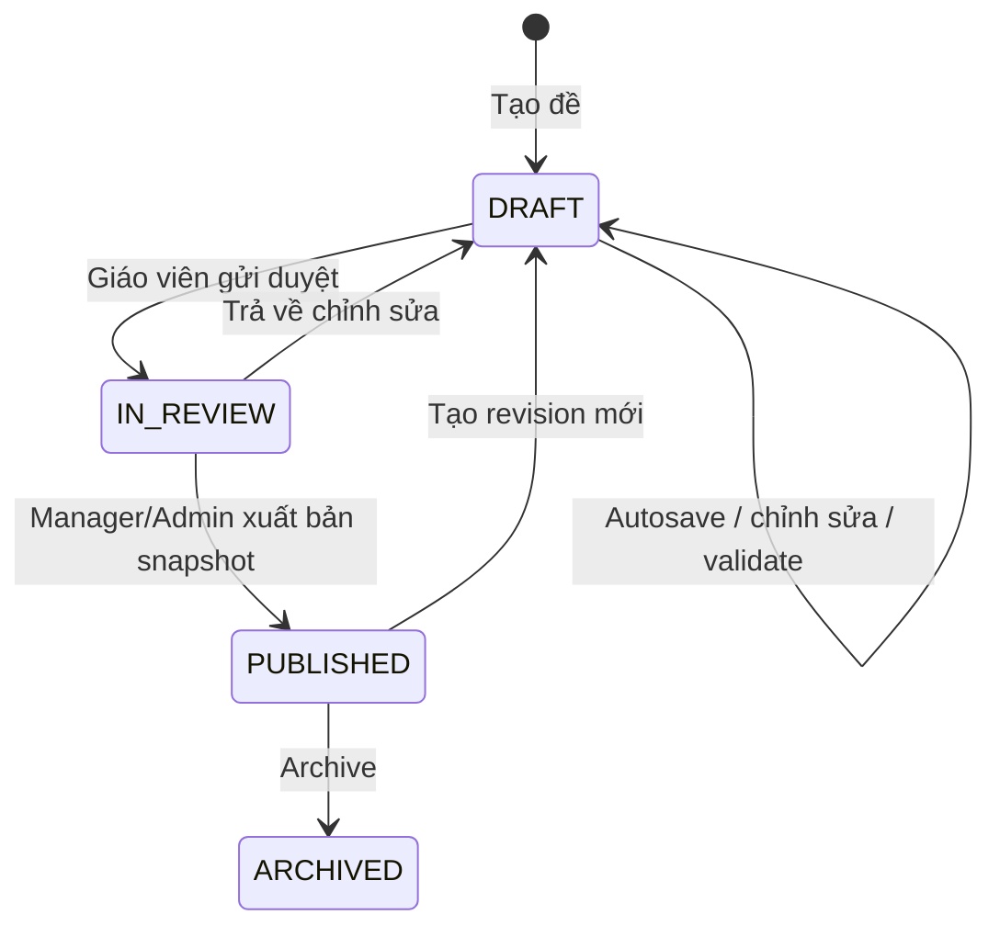

# Tổng quan hệ thống The IELTS Spells

> **Phiên bản tài liệu:** 0.1  
> **Cập nhật:** 08/09/2026  
> **Phạm vi:** website công khai, không gian học viên, cổng quản trị và Backend API của The IELTS Spells.

## 1. Giới thiệu

**The IELTS Spells** là nền tảng EdTech phục vụ vận hành một trung tâm IELTS và hành trình học của học viên. Hệ thống hợp nhất các nghiệp vụ thường bị tách rời: tuyển sinh, hồ sơ học viên, lớp học, lịch học, điểm danh, học liệu, ngân hàng đề, tạo đề bốn kỹ năng và theo dõi tiến độ.

Mục tiêu không phải chỉ là một website giới thiệu khóa học. Đây là một hệ thống có ba bề mặt sử dụng:

| Bề mặt | Đối tượng | Mục đích |
| --- | --- | --- |
| Main Web | Khách vãng lai và học viên | Landing page, đăng ký tư vấn, đăng nhập và dần mở rộng thành không gian học/luyện đề của học viên. |
| Management Web | Admin, Quản lý, Giáo viên, Tuyển sinh | Quản trị dữ liệu, vận hành học vụ, biên soạn nội dung và xét duyệt/xuất bản đề. |
| Backend API | Hai ứng dụng frontend và các tích hợp | Nguồn sự thật của dữ liệu, quy tắc nghiệp vụ, phân quyền, lưu trữ tệp và audit. |

### 1.1. Phạm vi nghiệp vụ

- Quản lý nhân sự, phân quyền và lời mời kích hoạt tài khoản.
- Quản lý học viên và vòng đời ghi danh: đăng ký, chuyển lớp, bảo lưu, rút học, kích hoạt lại.
- Quản lý khóa học/lớp, buổi học, lịch học và điểm danh.
- Quản lý kho học liệu, media và bài tập mẫu.
- Quản lý ngân hàng đề IELTS và trình tạo đề Reading, Listening, Writing, Speaking.
- Chuẩn bị dữ liệu cho giao đề, làm bài, nộp bài, chấm và theo dõi tiến độ học viên.

## 2. Cơ sở lý thuyết và định hướng thiết kế

### 2.1. Hệ thống quản lý học tập theo vòng đời dữ liệu

Một LMS/EdTech có giá trị khi dữ liệu đi xuyên suốt từ tuyển sinh đến kết quả học tập. Vì vậy, hệ thống tổ chức theo các thực thể có vòng đời rõ ràng:

`Lead → Student → Enrollment → Course → Session / Activity → Progress / Attendance / Submission`.

Việc lưu lịch sử thay vì sửa/xóa dữ liệu trực tiếp giúp trung tâm giải thích được thay đổi ghi danh, điểm danh và nội dung đã giao ở từng thời điểm.

### 2.2. Phân quyền theo vai trò (RBAC)

Quyền thao tác dựa trên vai trò, còn việc ẩn nút trên giao diện chỉ hỗ trợ trải nghiệm chứ không phải cơ chế bảo mật. Backend luôn kiểm tra quyền trước khi xử lý.

| Vai trò | Trách nhiệm chính |
| --- | --- |
| `admin` | Quản trị hệ thống, nhân sự, cấu hình và xuất bản nội dung. |
| `manager` | Quản lý vận hành, khóa học, học viên và duyệt/xuất bản theo quyền. |
| `teacher` | Quản lý phần việc giảng dạy, học liệu và soạn đề trong phạm vi được cấp. |
| `admissions` | Tiếp nhận lead, hồ sơ học viên và ghi danh. |
| `student` | Học, làm bài, theo dõi kết quả trong Main Web. |

### 2.3. Modular Monolith thay vì microservices sớm

Backend dùng **modular monolith**: một ứng dụng Spring Boot nhưng được chia module nghiệp vụ độc lập tương đối. Cách này giảm chi phí vận hành ở giai đoạn đầu, vẫn giữ ranh giới rõ ràng để có thể tách dịch vụ khi tải hoặc nhu cầu tích hợp tăng cao.

Các module giao tiếp qua application service, event và contract có kiểm soát; không truy cập tùy tiện repository/domain nội bộ của module khác.

### 2.4. Versioning cho đề thi

Đề thi là nội dung có rủi ro cao: nếu đáp án hoặc câu hỏi bị sửa sau khi đã giao, kết quả học viên có thể không còn đối chiếu được. Vì vậy cần tách:

- **Bản nháp (draft):** cho phép giáo viên chỉnh sửa, autosave và kiểm tra lỗi.
- **Bản xuất bản (published version):** snapshot bất biến của đề đã được duyệt.
- **Bản giao bài (assignment):** tham chiếu đúng phiên bản đã xuất bản, không tham chiếu nội dung nháp mới hơn.

Đây là nền tảng để xem lại bài làm, chấm lại, audit và tạo revision mà không làm thay đổi lịch sử.

### 2.5. API-first và một nguồn dữ liệu nghiệp vụ

Supabase đảm nhiệm Authentication và có thể đảm nhiệm Object Storage. Tuy nhiên, PostgreSQL và Backend API mới là nguồn sự thật cho dữ liệu nghiệp vụ. Frontend chỉ gửi JWT Bearer tới API; không được ghi trực tiếp các bảng nghiệp vụ từ trình duyệt.

## 3. Phân tích bài toán

### 3.1. Vấn đề cần giải quyết

| Vấn đề vận hành | Hướng giải quyết trong hệ thống |
| --- | --- |
| Dữ liệu học viên, lớp, lịch và điểm danh phân tán | Xây dựng Course workspace thống nhất và quan hệ Enrollment có vòng đời. |
| Học liệu khó tìm, khó phân quyền và khó tái sử dụng | Kho học liệu có metadata, phạm vi dùng chung/theo khóa, trạng thái hiển thị và tệp đính kèm xác thực. |
| Biên soạn đề IELTS dài, nhiều dạng câu hỏi, dễ mất dữ liệu | Test Builder chia theo kỹ năng/part/passage, question group, autosave, validation và preview. |
| Nội dung đề đã giao có thể bị thay đổi | Dùng draft revision và published test version bất biến. |
| Phân quyền chỉ ở giao diện | Kiểm tra JWT và authority tại Backend API. |
| Dữ liệu giả làm che mất lỗi tích hợp | Màn hình production phải có loading, empty, error, retry; không tự rơi về mock data. |

### 3.2. Đối tượng sử dụng và nhu cầu

| Nhóm | Nhu cầu cốt lõi |
| --- | --- |
| Khách hàng tiềm năng | Hiểu giá trị trung tâm, khóa học, giáo viên; để lại yêu cầu tư vấn. |
| Học viên | Xem lộ trình, nhận học liệu/đề, làm bài và theo dõi tiến độ. |
| Giáo viên | Chuẩn bị học liệu, biên soạn bài/đề, theo dõi lớp và ghi nhận học tập. |
| Tuyển sinh | Quản lý lead, học viên và quá trình ghi danh. |
| Quản lý/Admin | Điều phối học vụ, duyệt nội dung, quản trị nhân sự và báo cáo. |

## 4. Mục tiêu hệ thống

### 4.1. Mục tiêu nghiệp vụ

1. Chuẩn hóa vận hành của trung tâm trên một hệ thống thống nhất.
2. Rút ngắn thời gian tạo, duyệt và tái sử dụng tài liệu/đề IELTS.
3. Bảo toàn lịch sử học tập, đề đã giao và thay đổi học vụ.
4. Tạo nền tảng để cá nhân hóa lộ trình và phân tích điểm yếu theo kỹ năng/dạng câu hỏi.

### 4.2. Mục tiêu kỹ thuật

1. Frontend và Backend có contract rõ ràng, dùng dữ liệu thật.
2. Bảo mật xác thực qua Supabase JWT và phân quyền tại server.
3. CSDL được quản lý bằng Flyway migration, có thể triển khai lặp lại.
4. Tài liệu/tệp được kiểm soát MIME type, dung lượng, quyền truy cập và vòng đời URL.
5. Giao diện responsive, keyboard-accessible và có trạng thái tải/lỗi/rỗng rõ ràng.

### 4.3. Tiêu chí chất lượng

- Không đưa service-role key, mật khẩu database hay signed URL lâu dài vào frontend/log.
- Không sửa migration Flyway đã chạy ở môi trường dùng chung.
- Không dùng index mảng làm định danh cho passage, group, câu hỏi hoặc tệp có thể sắp xếp lại.
- Mọi mutation có loading, chống submit hai lần, phản hồi thành công/lỗi và validation dễ hiểu bằng tiếng Việt.
- Mọi dữ liệu ngày giờ dùng ISO-8601 ở API, chỉ format theo tiếng Việt tại UI.

## 5. Yêu cầu chức năng

### 5.1. Xác thực và nhân sự

- Đăng nhập, đăng xuất, làm mới phiên qua Supabase Auth.
- API trả hồ sơ hiện tại qua `/api/v1/auth/me`.
- Nhân sự quản trị theo cơ chế lời mời, kích hoạt tài khoản và thu hồi lời mời.
- Quản lý vai trò và route/action guard theo `admin`, `manager`, `teacher`, `admissions`.

### 5.2. Tuyển sinh, học viên và ghi danh

- Tiếp nhận và theo dõi lead.
- Danh sách, tìm kiếm và xem chi tiết học viên.
- Ghi danh một học viên vào nhiều Course.
- Quản lý chuyển Course, bảo lưu, rút học và kích hoạt lại trên Enrollment; không xóa hồ sơ học viên để xóa một lần ghi danh.

### 5.3. Khóa học, lịch và điểm danh

- Course là aggregate duy nhất cho cả **khóa học và lớp học**; không tạo thêm mô hình Class độc lập.
- Một Course chỉ thuộc một cặp kỹ năng: `LISTENING_READING` hoặc `SPEAKING_WRITING`.
- Tạo buổi học đơn lẻ/hàng loạt từ lịch mẫu; đổi lịch khi cần.
- Khởi tạo roster điểm danh theo từng buổi, khóa/mở lại buổi điểm danh.
- Học viên vào lớp sau khi buổi đã tạo vẫn hiển thị trong roster với trạng thái chưa đánh dấu, không bị ẩn khỏi lịch sử.
- Theo dõi progress và activity matrix theo Course.

### 5.4. Kho học liệu và Media Library

- Tạo học liệu dạng tệp, link ngoài hoặc nội dung văn bản.
- Gắn kỹ năng, nhóm nội dung, tags, phạm vi dùng chung/theo Course và trạng thái publish/hide.
- Upload tệp bằng `multipart/form-data`, kiểm tra loại/kích thước ở Backend.
- Xem trước/tải tệp qua API có xác thực; Storage provider có thể là local hoặc Supabase Storage.
- Quản lý media dùng chung và exercise template để tái sử dụng.

### 5.5. Ngân hàng đề và Test Builder

- Danh sách đề có tìm kiếm, phân loại theo kỹ năng, loại đề, format, trạng thái và phân trang server-side.
- Tạo đề với tên, kỹ năng, cấu trúc/format, thời lượng, mô tả và tags cần thiết.
- Lưu nháp, kiểm tra validation, gửi duyệt, xuất bản, trả về chỉnh sửa, archive và tạo revision.
- Liệt kê version đã xuất bản của đề.
- Xem trước nội dung đã lưu theo presentation model của học viên.

### 5.6. Builder bốn kỹ năng

| Kỹ năng | Cấu trúc cần hỗ trợ |
| --- | --- |
| Reading | Test → Passage → Question Group → Question → Option/Answer/Explanation; soạn passage rich text, highlight vị trí đáp án, minh họa cho dạng diagram/matching, gap filling, shared option bank. |
| Listening | Test → Part → Question Group → Question; audio player sticky, upload audio, transcript rich text, timestamp và liên kết đoạn audio với câu hỏi. |
| Writing | Task 1/Task 2 với đề bài, ảnh/biểu đồ hoặc nguồn liệu, thời lượng, gợi ý có thể bật/tắt và presentation cho học viên viết bài. |
| Speaking | Part 1/2/3 với topic, cue card/câu hỏi, audio nếu có, cấu hình gợi ý theo đề và presentation hỗ trợ luyện nói/ghi âm. |

**Quy tắc Passage Reading:** đề Passage lẻ không được thêm/bớt passage. Chỉ khi khởi tạo Reading Full Test mới cho phép cấu hình thêm hoặc bớt passage trong giới hạn nghiệp vụ.

### 5.7. Giao đề và trải nghiệm học viên

- Giao đúng `test_version_id` đã xuất bản cho học viên/Course.
- Hiển thị đề bằng dữ liệu phiên bản đã giao; không hiển thị draft của giáo viên.
- Lưu câu trả lời, trạng thái làm bài và submission theo attempt.
- Xem lại phải dùng đúng snapshot, đáp án, giải thích và highlight vị trí tương ứng.
- Luyện Reading/Listening cần hỗ trợ điều hướng câu hỏi, independent scrolling và dữ liệu câu hỏi thật.

> Giao đề, attempt, submission và chấm kết quả là luồng cần được hoàn thiện đồng bộ với snapshot version; không được xem preview quản trị là thay thế cho player học viên thực tế.

## 6. Thiết kế tổng thể

### 6.1. Kiến trúc logic



### 6.2. Frontend

Frontend là pnpm workspace, bao gồm:

```text
the-ielts-spells-frontend/
├── apps/
│   ├── main-web/          # Next.js 16: landing page và không gian học viên
│   └── management-web/    # React 19 + Vite 7: cổng vận hành
└── packages/
    ├── api-client/        # transport, token, chuẩn hóa lỗi
    ├── contracts/         # TypeScript contracts dùng chung
    ├── design-tokens/     # token giao diện
    └── ui/                # UI primitives tái sử dụng
```

- `main-web` sở hữu trải nghiệm học viên và các trang công khai.
- `management-web` sở hữu tác vụ authoring, publish, assignment, review và vận hành.
- Chỉ `api-client`/lớp API gọi các đường dẫn tương đối `/api/v1/...`; page/component không tự tạo fetch wrapper riêng.
- Màn hình production phải thể hiện loading, empty, validation error, 401, 403, 404, conflict và lỗi provider/server có thể retry.

### 6.3. Backend

Backend dùng Java 21, Spring Boot 3.5, Maven và Spring Modulith. Cấu trúc module theo bốn lớp:

```text
<module>/
├── domain/           # aggregate, value object, domain rule
├── application/      # use case, transaction, DTO mapping
├── infrastructure/   # JPA, storage provider, external provider
└── presentation/     # REST controller, request/response
```

| Module | Trách nhiệm |
| --- | --- |
| `identity` | Hồ sơ, role, Supabase identity và lời mời nhân sự. |
| `admissions` | Lead và luồng tuyển sinh. |
| `academic` | Course, session, enrollment, lịch mẫu, chuyển/bảo lưu. |
| `attendance` | Roster và trạng thái điểm danh theo session. |
| `learninglibrary` | Học liệu, tệp, media, exercise template và storage provider. |
| `testing` | Test bank, builder content, validation, revision và published version. |
| `progress` | Tiến độ hoạt động theo Course. |
| `assignment` | Nền tảng giao/nộp bài. |
| `writingevaluation` | Nền tảng đánh giá bài Writing. |
| `cms` | Nội dung công khai. |
| `notification`, `reporting`, `audit` | Thông báo, báo cáo và truy vết hoạt động. |
| `shared` | Kiểu dùng chung, lỗi, pagination, security/persistence helpers. |

### 6.4. Persistence, migration và Storage

- PostgreSQL là cơ sở dữ liệu nghiệp vụ.
- Flyway quản lý schema theo các file `src/main/resources/db/migration/Vxxx__description.sql`.
- Migration đã chạy không được sửa; thay đổi phải tạo migration mới.
- Supabase Auth quản lý `auth.users`; Backend đồng bộ/đối chiếu identity và role nghiệp vụ trong schema `public`.
- Tệp học liệu được lưu qua abstraction storage provider. Không trả public URL vô thời hạn cho tệp cần bảo vệ.

### 6.5. Bảo mật

- Backend là OAuth2 Resource Server, xác minh Supabase JWT thông qua issuer/JWK.
- API nghiệp vụ yêu cầu `Authorization: Bearer <access-token>`.
- Service role key chỉ tồn tại ở Backend/môi trường deploy, không bao giờ là `NEXT_PUBLIC_*` hay `VITE_*`.
- CORS chỉ mở các origin cần thiết theo môi trường.
- Endpoint theo dõi sức khỏe `/actuator/health`; OpenAPI/Swagger dùng cho môi trường được kiểm soát.

## 7. Thiết kế dữ liệu và luồng hiện thực

### 7.1. Luồng tuyển sinh đến học tập



### 7.2. Luồng tạo và xuất bản đề



Trong database hiện tại, một trạng thái legacy có thể được lưu với tên khác nhưng UI phải diễn giải theo workflow nghiệp vụ ở trên, không để enum kỹ thuật lộ ra cho người dùng.

### 7.3. Mô hình dữ liệu đề thi

```text
Test
├── Draft builder content (editable JSON/document)
├── Passage hoặc Part (có thứ tự)
│   └── Question group (dạng bài, instructions, shared options, illustration)
│       └── Question (nội dung, đáp án, giải thích, evidence/highlight)
└── Test version (snapshot khi published)
    └── Test assignment → Attempt → Submission / Result
```

Draft JSON thuận tiện cho builder, nhưng không được coi là đề chạy cho học viên. Trước khi publish, server phải validate và materialize/đóng gói dữ liệu cần thiết trong `test_versions` hoặc snapshot tương đương. Assignment luôn tham chiếu `test_version_id`.

### 7.4. Validation trước publish

Tối thiểu phải kiểm tra:

- Có title, skill, format và cấu trúc passage/part hợp lệ.
- Mỗi question group có tiêu đề, loại bài, instructions và số câu hợp lệ.
- Mỗi câu có nội dung; câu trắc nghiệm có option và đáp án đúng; gap fill có quy tắc đáp án/word limit.
- Reading Full Test đúng số passage theo cấu hình và phạm vi số câu không chồng chéo.
- Listening có audio hoặc nguồn audio hợp lệ khi loại đề yêu cầu.
- Image/diagram đã upload thành công và liên kết đúng question group.
- Không xuất bản khi còn lỗi validation; client chỉ hiển thị lỗi từ server, không tự đặt trạng thái published.

## 8. Danh sách chức năng theo trạng thái

Ký hiệu: **Đã có nền tảng** = có module/route/API hoặc UI chính; **Đang hoàn thiện** = cần kết nối hoặc hoàn chỉnh workflow; **Định hướng** = yêu cầu kế tiếp đã xác định.

| Nhóm | Chức năng | Trạng thái |
| --- | --- | --- |
| Public | Landing page, giới thiệu, khóa học, giáo viên, feedback, tư vấn | Đang hoàn thiện theo hướng triển khai Main Web. |
| Auth | Supabase session, JWT xác minh, hồ sơ hiện tại | Đã có nền tảng. |
| Staff | Lời mời, kích hoạt, thu hồi lời mời, danh sách nhân sự | Đã có nền tảng. |
| Admissions | Lead, học viên, enrollment | Đã có nền tảng. |
| Academic | Course, skill pair, sessions, lịch mẫu, đổi lịch | Đã có nền tảng. |
| Attendance | Khởi tạo roster, điểm danh, lock/reopen | Đã có nền tảng. |
| Progress | Tiến độ theo Course/activity | Đã có nền tảng. |
| Library | Summary, resource, tệp, media, exercise template | Đã có nền tảng. |
| Storage | Local provider và khả năng dùng Supabase Storage | Đã có nền tảng; cần cấu hình production. |
| Test bank | List/filter/page/create/update/archive | Đã có nền tảng. |
| Test lifecycle | Validation, review, publish snapshot, revision, versions | Đã có nền tảng. |
| Reading builder | Passage, rich text, group/question, gap fill, image/highlight, preview | Đang hoàn thiện và cần kiểm thử end-to-end với API thật. |
| Listening builder | Part, audio, transcript rich text, timestamp, group/question | Đang hoàn thiện và cần kiểm thử end-to-end với API thật. |
| Writing builder | Task configuration, prompt/source, hints, student presentation | Đang hoàn thiện. |
| Speaking builder | Part 1/2/3, topic/cue card, hints, recording-oriented presentation | Đang hoàn thiện. |
| Student test player | Nhận assignment theo version, attempt, autosave answer, submit/result | Định hướng ưu tiên tiếp theo. |
| AI Writing | Cấu trúc module đánh giá Writing | Định hướng tích hợp/hoàn thiện provider và rubric. |
| Reporting | Cấu trúc module báo cáo | Định hướng mở rộng dashboard và chỉ số vận hành. |

## 9. Hiện thực API tiêu biểu

API có base path `/api/v1`. Một số nhóm endpoint quan trọng:

| Nhóm | Ví dụ endpoint |
| --- | --- |
| Hồ sơ đăng nhập | `GET /api/v1/auth/me` |
| CMS công khai | `GET /api/v1/public/home` |
| Course | `GET/POST /api/v1/admin/courses`, `GET /api/v1/admin/courses/{id}` |
| Session | `/api/v1/admin/courses/{courseId}/sessions` |
| Attendance | `/api/v1/admin/courses/{courseId}/attendance/sessions` |
| Progress | `GET /api/v1/admin/courses/{courseId}/progress` |
| Students/Enrollment | `/api/v1/admin/students`, `/api/v1/admin/enrollments` |
| Library | `/api/v1/admin/library/resources`, `/media`, `/exercises` |
| Test Bank | `/api/v1/admin/test-bank` |
| Test validation/version | `/{id}/validation`, `/{id}/versions`, `/{id}/revisions`, `/{id}/status` |

Danh sách đầy đủ và schema request/response được xem qua Swagger khi Backend chạy: `/swagger-ui/index.html`.

## 10. Cài đặt, vận hành và triển khai

### 10.1. Môi trường phát triển

| Thành phần | Lệnh / địa chỉ mặc định |
| --- | --- |
| Backend | `mvn spring-boot:run` — `http://localhost:8080` |
| Swagger | `http://localhost:8080/swagger-ui/index.html` |
| Health | `http://localhost:8080/actuator/health` |
| Main Web | `pnpm dev:main` — thường là `http://localhost:3000` |
| Management Web | `pnpm dev:management` — `http://localhost:5174` |

### 10.2. Biến môi trường

Backend cần cấu hình database, Supabase JWT issuer/JWK/audience, CORS và storage provider. Frontend chỉ cần API URL, Supabase URL và publishable/anon key.

Không ghi giá trị thật vào README/tài liệu, source control, ảnh chụp màn hình hoặc issue. Không đưa database password hay `SUPABASE_SERVICE_ROLE_KEY` cho frontend.

### 10.3. Triển khai database

1. Tạo project PostgreSQL/Supabase và sao lưu dữ liệu nếu có.
2. Cấu hình `DATABASE_URL`, username/password, Supabase JWT settings và CORS ở môi trường Backend.
3. Đảm bảo schema `public` phù hợp với Flyway history trước lần chạy đầu.
4. Khởi động Backend để Flyway áp dụng các migration theo thứ tự.
5. Kiểm tra `/actuator/health`, bảng `flyway_schema_history`, các role/profile cần thiết và API `/api/v1/auth/me`.
6. Cấu hình frontend production trỏ tới Backend API và Supabase project tương ứng.

> Không bật baseline hoặc xóa schema để xử lý lỗi Flyway trên môi trường có dữ liệu mà chưa xác định migration history và kế hoạch khôi phục.

### 10.4. Kiểm thử tối thiểu

| Loại thay đổi | Kiểm tra bắt buộc |
| --- | --- |
| Migration/domain/API | `mvn verify`, migration trên database sạch/test và endpoint smoke test có JWT thật. |
| Frontend contract/UI | `pnpm typecheck`, `pnpm build`, kiểm tra browser với API thật. |
| Test builder | Tạo draft → autosave → validate → gửi duyệt → publish → revision → preview/version. |
| Học viên làm đề | Giao đúng version → mở đề → lưu đáp án → nộp bài → xem lại snapshot. |
| Tệp | Upload loại hợp lệ/không hợp lệ, download xác thực, phân quyền và URL hết hạn nếu có. |

## 11. Lộ trình đề xuất sau khi hoàn thiện builder

### Ưu tiên 1 — Hoàn chỉnh “publish to student”

1. Hoàn thiện chuyển draft builder sang payload/version chạy được.
2. Xây dựng Test Assignment có `test_version_id`, đối tượng nhận, thời gian mở/đóng và thời lượng.
3. Xây dựng Main Web test player dùng dữ liệu thật cho Reading/Listening trước.
4. Lưu attempt, câu trả lời, autosave, submit, chấm tự động phần objective và review.

### Ưu tiên 2 — Hoàn chỉnh vận hành học vụ

1. Gắn học liệu, assignment và activity vào Course workspace.
2. Đồng bộ attendance/progress với activity và dashboard học viên.
3. Hoàn thiện thông báo cho lịch học, bài được giao, hạn nộp và kết quả.

### Ưu tiên 3 — Chất lượng và khả năng mở rộng

1. Bổ sung audit log có thể tra cứu cho publish, enrollment, attendance và thay đổi quyền.
2. Thêm test tự động cho domain/contract và E2E cho các luồng rủi ro cao.
3. Quan sát hệ thống: health check, structured logs, tracking lỗi và backup/restore database.
4. Thiết lập retention, quotas và chính sách storage cho audio/ảnh/tài liệu.
5. Khi có dữ liệu đủ tin cậy, phát triển báo cáo và AI Writing Evaluation theo rubric minh bạch.

## 12. Quy ước phát triển quan trọng

- Backend thay đổi contract trước; sau đó cập nhật TypeScript contract/API client; cuối cùng mới sửa màn hình.
- Không dùng mock data làm fallback runtime khi API lỗi. Hiển thị empty/error state trung thực.
- Không mở rộng phạm vi bằng cách tạo module/chức năng trùng lặp với `Course`, `Enrollment`, `Learning Library` hoặc `Test Bank` đã có.
- Với content builder, stable UUID là identity; thứ tự được lưu bằng field order và cập nhật atomically.
- Chức năng xóa/thu hồi/archive phải có confirmation và mô tả ảnh hưởng nghiệp vụ.
- Mọi tài liệu kỹ thuật cần ghi rõ phần nào đã triển khai, phần nào đang hoàn thiện và phần nào chỉ là định hướng.

---

Tài liệu này là điểm tham chiếu kiến trúc ở cấp hệ thống. Tài liệu chi tiết cho Backend và Frontend nằm lần lượt tại `the-ielts-spells-backend/README.md`, `the-ielts-spells-backend/AGENTS.md`, `the-ielts-spells-frontend/README.md` và `the-ielts-spells-frontend/AGENTS.md`.
